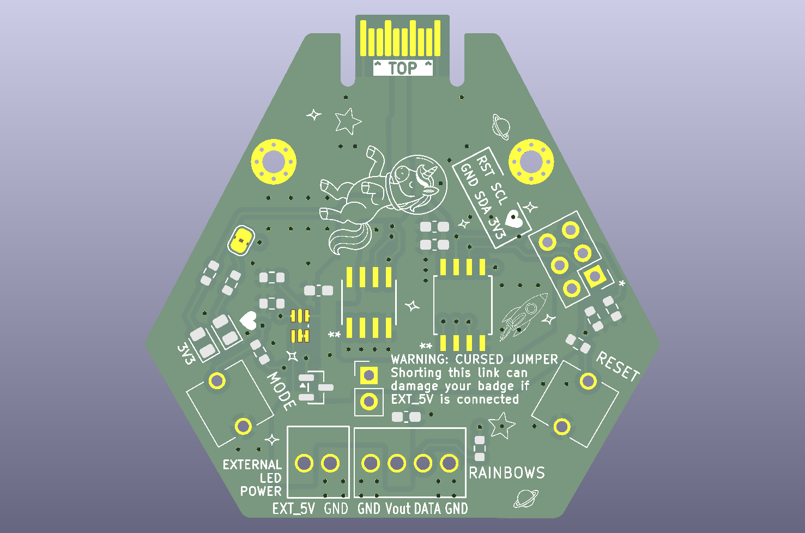
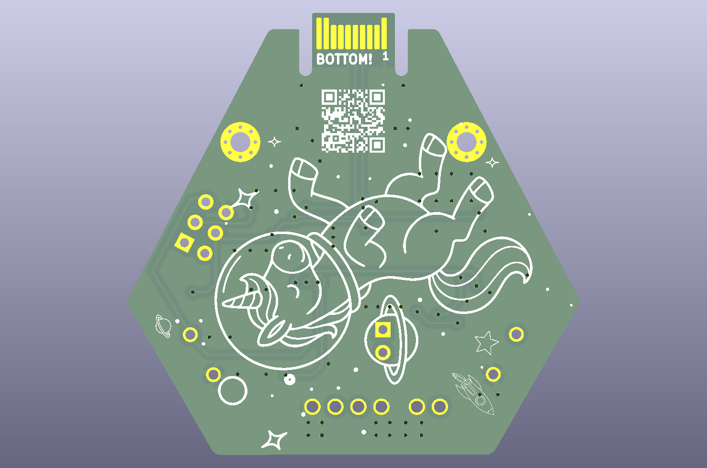

# Space Unicorn — hardware

KiCad design files for the EMF26 Space Unicorn hexpansion.

| Front | Rear |
|:-----:|:----:|
|  |  |

## Contents

| Path | What |
|------|------|
| `hexpansion.kicad_pro` / `.kicad_sch` / `.kicad_pcb` | KiCad project, schematic and board. |
| `fp-lib-table`, `sym-lib-table` | Library tables. |
| `*.pretty/` | Project-local footprint libraries (`unicorn`, `heart`, `gfx`, `NextPCB`). |
| `gerbers/` | Gerbers + drill files for fabrication. |
| `renders/` | Board renders and the paper template. |
| `LICENSE.txt` | Hardware licence. |

## Notes

- The board carries an **ATtiny85** (WS2812 driver, I²C `0x40`), an **M24256E**
  EEPROM (hexpansion identity + resident app), and a **BC857BS** for Ext_5V
  reverse-feed protection.
- `fp-lib-table` references some footprints by absolute local paths (parts from
  `…/Hardware/parts/…`) and a sibling `tildagon-base`. These won't resolve on a
  fresh clone, but KiCad **caches footprints in the `.kicad_pcb`**, so the board
  opens, views and plots correctly. Re-point those library entries if you need to
  edit footprints.

## Related

- Firmware: this repository's root.
- Tildagon control app: <https://github.com/Corteil/tildagon-space-unicorn>
